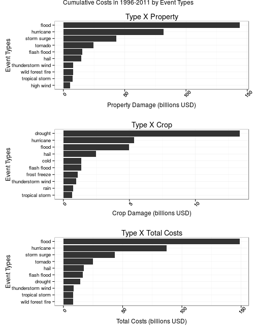

## **Synopsis**

The annual costs of the ten worst weather events spread between 5.51 and 125 billions USD at 1996-2011 period and the yearly fatalities spread between 1687 and 11864 citizens.

The ten worst events that caused more deaths was heat, tornado, flash flood, lightning, rip current, flood, thunderstorm wind, high wind, avalanche and winter storms and those that more hurt was  tornado, heat, flood, thunderstorm wind, lightning,  flash flood, wild forest fire, hurricanes, winter storms and high wind.

The property damages were by event type almost ten times higher than those crops. Ten worst types for properties were flood, hurricane, storm surge, tornado, flash flood, hail, thunderstorm wind, wild forest fire, tropical storm and high wind. 

Other ten worst types for cropies were: drought, hurricane, flood, hail, flash flood, extreme cold, frost freeze, thunderstorm wind, rain and tropical storm.

Of course the most frequent events may not be neither the most fatal nor that bring higher losses and therefore not serve as a compass for government action.

The North American citizens should be prepared to meet these challenges and agencies of interest in this area should continue its efforts to standardize your records and make them public. This work will give climate predictions more accurate, saving lives and wealth.

## **Introduction**

Many severe weather events can result in fatalities, injuries, and property damage, and preventing such outcomes to the extent possible is a key concern and this project involves exploring the U.S. National Oceanic and Atmospheric Administration's (NOAA) storm database. 

The events in the database start in the year 1950 and end in November 2011, but in the earlier years of the database there are generally fewer events recorded, most likely due to a lack of good records. More recent years should be considered more complete: ["3. All Event Types (48 from Directive 10-1605): From 1996 to present, 48 event types are recorded as defined in NWS Directive 10-1605"](http://www.ncdc.noaa.gov/stormevents/details.jsp).

## **Data Processing**

Our data analysis must address the following questions:

*  Across the United States, which types of events (as indicated in the EVTYPE variable) are most harmful with respect to population health?

*  Across the United States, which types of events have the greatest economic consequences?

The document was produced with **R version 3.1.2 at a i686-pc-linux-gnu (32-bit) Ubuntu**, also we settled the local time -  _it shall be resettled at the end_ - and global options for knitr:  


```r
knitr::opts_chunk$set(echo=TRUE,cache=FALSE)
local <- Sys.getlocale(category = "LC_TIME")
Sys.setlocale("LC_TIME", "en_US.UTF-8")
```

We called the following libraries:  

```r
if(!library(RCurl, logical.return = TRUE)) install.packages("RCurl", dependencies=TRUE)
```

```
## Loading required package: bitops
```

```r
if(!library(knitr, logical.return = TRUE)) install.packages("knitr", dependencies=TRUE)
if(!library(dplyr, logical.return = TRUE)) install.packages("dplyr", dependencies=TRUE)
```

```
## 
## Attaching package: 'dplyr'
## 
## The following object is masked from 'package:stats':
## 
##     filter
## 
## The following objects are masked from 'package:base':
## 
##     intersect, setdiff, setequal, union
```

```r
if(!library(tidyr, logical.return = TRUE)) install.packages("tidyr", dependencies=TRUE)
if(!library(magrittr, logical.return = TRUE)) install.packages("magrittr", dependencies=TRUE)
```

```
## 
## Attaching package: 'magrittr'
## 
## The following object is masked from 'package:tidyr':
## 
##     extract
```

```r
if(!library(lubridate, logical.return = TRUE)) install.packages("lubridate", dependencies=TRUE)
if(!library(xtable, logical.return = TRUE)) install.packages("xtable", dependencies=TRUE)
if(!library(ggplot2, logical.return = TRUE)) install.packages("ggplot2", dependencies=TRUE)
if(!library(pracma, logical.return = TRUE)) install.packages("pracma", dependencies=TRUE)
```

```
## 
## Attaching package: 'pracma'
## 
## The following objects are masked from 'package:magrittr':
## 
##     and, mod, or
```

```r
if(!library(gridExtra, logical.return = TRUE)) install.packages("gridExtra", dependencies=TRUE)
```

```
## Loading required package: grid
```

```r
library(RCurl)
library(knitr)
library(dplyr)
library(tidyr)
library(magrittr)
library(lubridate)
library(xtable)
library(ggplot2)
library(pracma)
library(gridExtra)
```

We downloaded and unziped the [Storm Data](https://d396qusza40orc.cloudfront.net/repdata%2Fdata%2FStormData.csv.bz2) file from the course web site:

There is also some documentation of the database available that we will find how some of the variables are constructed/defined.

*  National Weather Service [Storm Data Documentation](https://d396qusza40orc.cloudfront.net/repdata%2Fpeer2_doc%2Fpd01016005curr.pdf).

*  National Climatic Data Center Storm Events [FAQ](https://d396qusza40orc.cloudfront.net/repdata%2Fpeer2_doc%2FNCDC%20Storm%20Events-FAQ%20Page.pdf).


```r
url <- "https://d396qusza40orc.cloudfront.net/repdata%2Fdata%2FStormData.csv.bz2"
spliturl   <- unlist(strsplit(url,"/|%2F"))
zipfile    <- spliturl[length(spliturl)]
if ( ! file.exists(zipfile) ) {
        download.file(url, zipfile, method="curl")
        }
bzfile(description=zipfile, open = "rb", encoding = getOption("encoding"),compression = 9)
datafile <- bzfile(zipfile)
data1 <- tbl_df(read.csv(datafile))
time <- format(Sys.time(),"%a %b %d %X %Y")
```

The current time is Mon Jan 26 11:14:51 PM 2015.  

We decided to chose the following variables and our assumptions in absence of data's code book were based on the NOOA's report:

*  DATE: transformed begin date from BGN_DATE variable with "_month/day/year 00:00:00_" to "year" format.

*  FATALITIES: number of people killed directly or indirectly by the event.

*  INJURIES: number of people injured directly or indirectly by the event.

*  EVTYPE: type of the meteorological event leading to fatalities, injuries, damages, etc.

*  PROPDMG: property damage estimates in US dollar. 

*  PROPDMGEXP: the characters mean powers of ten, the final values are product between PROPDMG and PROPDMGEXP.

*  CROPDMG: Crop damage estimates in US dollar amounts.

*  CROPDMGEXP: exponents are similar to PROPDMGEXP.

We assumed that damage to the property is "propdmg" variable and they are multiplied by powers of ten with transformed "propdmgexp" variable, as well with crop's damage in "cropdmg" and "cropdmgexp" variables in accordance with [page 12](http://www.ncdc.noaa.gov/stormevents/pd01016005curr.pdf) of NOAA's report.


```r
colnames(data1) %<>% sapply(tolower)
firstElement <- function(x){x[1]}
data1$bgn_date %<>% as.character
y <- strsplit(data1$bgn_date, " ") 
data1$date  <- sapply(y, firstElement)
data1$date %<>% mdy 
data1$date %<>% year
data1 %<>% filter(date > 1995)

# selecting our interest's variables
data1 %<>%
        select(date,evtype,fatalities:cropdmgexp)
data1$propdmgexp %<>% as.character
data1$cropdmgexp %<>% as.character        
exchange <- data.frame(power_char=c("0", "+", "-", "?", "" , "1", "2", "H", "h", "3","k", "K", "4", "5", "6", "m", "M",  "7",  "8", "B"), power_int=c(0, 0, 0, 0, 0, 1, 2, 2, 2, 3, 3, 3, 4, 5, 6, 6, 6, 7, 8, 9))
data1 %<>% merge(exchange,by.x="propdmgexp",by.y="power_char") %>%
                mutate(propdmg=propdmg*10^power_int) 
data1 %<>% select(-propdmgexp,-power_int)
data1 %<>% merge(exchange,by.x="cropdmgexp",by.y="power_char") %>%
                mutate(cropdmg=cropdmg*10^power_int) 
data1 %<>% select(-cropdmgexp,-power_int) 
# making well formated values for evtype variable: GSUB PROCEDURE
data1$evtype %<>% tolower
for(i in 1:20){
        data1$evtype <- gsub("(hurricane edouard|hurricane typhoon|typhoon|hurricane hurricane)","hurricane",data1$evtype)
        data1$evtype <- gsub("(wildfire|brush fire)","wild forest fire",data1$evtype)
        data1$evtype <- gsub("tstm","thunderstorm",data1$evtype)
        data1$evtype <- gsub("strm","stream",data1$evtype)
        data1$evtype <- gsub("wnd","wind",data1$evtype)
        data1$evtype <- gsub("mud slide","mudslide",data1$evtype)
        data1$evtype <- gsub("coastalstorm","coastal storm",data1$evtype)
        data1$evtype <- gsub("(coastal flood erosion|coastalflood)","coastal flood",data1$evtype)
        data1$evtype <- gsub("(wintery mix|wintry mix|winter weather mix)","winter weather",data1$evtype)
        data1$evtype <- gsub("(fld|flooding|floodg|flood flood)","flood",data1$evtype)
        data1$evtype <- gsub("(agricultural|early|late|very|abnormally|abnormal|unseasonal|excessive|unseasonable|heavy|hard|unseasonably|record|gusty  |gusty |minor|moderate|monthly|unusual|dense|^ly )","",data1$evtype)
        data1$evtype <- gsub("(/|-|  )"," ",data1$evtype)
        data1$evtype <- gsub("(\\(|\\)|&|^  |^ |[Gg ][0-9]+$| $|s$|[Gg][0-9]+$|[0-9]+$|\\(0\\.75\\))","",data1$evtype)
        i <- i+1
        }
data1$evtype %<>% as.factor
evtype_number <- length(unique(data1$evtype))
```

We got 275 types of events with _gsub procedure_ and among them there are values that differed by having some adjectives, adverbs and white spaces that also eliminated and some abbreviations that were undone. Information lost on the one hand and on the other aggregate values that would otherwise be considered more appropriately similar.


```r
# Costs(billions USD) and Fatalities by Year: 1996 to 2011

by_year <- data1 %>% 
        group_by(date) %>%
                summarise(deaths=sum(fatalities),hurts=sum(injuries),
                          property=sum(propdmg/10^9),crop=sum(cropdmg/10^9),
                          total_costs=sum((propdmg+cropdmg)/10^9))
# Cumulative Costs(billions USD) and Fatalities by Event Types
by_eventype <- data1 %>% 
        group_by(evtype) %>%
                summarise(frequency=n(),deaths=sum(fatalities),hurts=sum(injuries),
                  property=sum(propdmg/10^9),crop=sum(cropdmg/10^9),
                  total_costs=sum((propdmg+cropdmg)/10^9))
```

## **Results**

Initially we point out that the most frequent events in the sixteen years were not the ones who caused more deaths, injuries and losses. Below table shows the absolute cumulative frequency in these years according to the types of events and we can compare the following figure:


```r
# cumulative deaths, injuries, frequency, property damage, crop damage and
# damage' sum by event type at '1996-2011' period.
top_deathEV <- by_eventype %>% 
        select(evtype,deaths) %>% 
                arrange(desc(deaths)) %>% 
                        top_n(10,deaths)
top_hurtEV <- by_eventype %>% 
        select(evtype,hurts) %>% 
                arrange(desc(hurts)) %>% 
                        top_n(10,hurts)
top_freqEV <- by_eventype %>% 
        select(evtype,frequency) %>% 
                arrange(desc(frequency)) %>% 
                        top_n(10,frequency)
top_freqEV$frequency <- format(top_freqEV$frequency/1000,digits=3)
        

top_propertyEV <- by_eventype %>% 
        select(evtype,property) %>% 
                arrange(desc(property)) %>% 
                        top_n(10,property)
top_cropEV <- by_eventype %>% 
        select(evtype,crop) %>% 
                arrange(desc(crop)) %>%
                        top_n(10,crop)
top_totalEV <- by_eventype %>% 
        select(evtype,total_costs) %>% 
                arrange(desc(total_costs)) %>%
                        top_n(10,total_costs)
```

In the table below we see that the numbers are divided per thousand for each type of event in cumulative way at 1996-2011 period and so the most frequent were:

| thunderstorm wind  | hail |flash flood |flood |tornado |high wind |snow |lightning |marine thunderstorm wind |rain |
| ----- | ----- | ------ | ----- | ----- | ------ | ----- | ----- | ------ |------ |
| 210.1  | 207.7 | 51.0 | 24.2 | 23.2 | 19.9 | 14.5 | 13.2 | 12.0 | 11.5 |

Thus the most frequent types - thunderstorm wind, hail, flash flood, flood, tornado, high wind, snow, lightning, marine thunderstorm and rain - were not the ones who gave more damage and not those who caused more deaths - heat, tornado, flash flood, lightning, rip current, flood, thunderstorm wind, high wind, avalanche and winter storms - and those that more hurt was  tornado, heat, flood, thunderstorm wind, lightning,  flash flood, wild forest fire, hurricanes, winter storms and high wind as the following two graphs show in next panel. Tornadoes have injuried more than heat, but heat is more killer than tornadoes.


```r
titulo1 <- "Event Types X Death" 
p1 <- ggplot(top_deathEV,aes(reorder(evtype,deaths),deaths))+ coord_flip()+
        geom_bar(stat="identity")+xlab("Event Types")+ylab("Deaths")+
        ggtitle(titulo1)+theme_bw()+theme(axis.text.x = element_text(angle=90))
titulo2 <- "Event Types X Hurts" 
p2 <- ggplot(top_hurtEV,aes(reorder(evtype,hurts),hurts))+ coord_flip()+
        geom_bar(stat="identity")+xlab("Event Types")+ylab("Hurts")+
        ggtitle(titulo2)+theme_bw()+theme(axis.text.x = element_text(angle=90))
grid.arrange(p1,p2,ncol=1, main = "Cumulative Fatalities and Injuries: 1996-2011")
```

 

Property and crop damages are seen in following panel by event type and property damage to almost ten times higher than those crops. Ten worst types for properties are flood, hurricane, storm surge, tornado, flash flood, hail, thunderstorm wind, wild forest fire, tropical storm and high wind. Other ten worst types for cropies are: drought, hurricane, flood, hail, flash flood, extreme cold, frost freeze, thunderstorm wind, rain and tropical storm.


```r
titulo4 <- "Type X Property" 
p4 <- ggplot(top_propertyEV,aes(reorder(evtype,property),property))+
        coord_flip()+geom_bar(stat="identity")+xlab("Event Types")+
        ylab("Property Damage (billions USD)")+ggtitle(titulo4)+
        theme_bw()+theme(axis.text.x = element_text(angle=90))
titulo5 <- "Type X Crop" 
p5 <- ggplot(top_cropEV,aes(reorder(evtype,crop),crop))+coord_flip()+
        geom_bar(stat="identity")+xlab("Event Types")+
        ylab("Crop Damage (billions USD)")+ggtitle(titulo5)+
        theme_bw()+theme(axis.text.x = element_text(angle=90))
titulo6 <- "Type X Total Costs" 
p6 <- ggplot(top_totalEV,aes(reorder(evtype,total_costs),total_costs))+
        coord_flip()+geom_bar(stat="identity")+xlab("Event Types")+
        ylab("Total Costs (billions USD)")+ggtitle(titulo6)+
        theme_bw()+theme(axis.text.x = element_text(angle=90))
grid.arrange(p4,p5,p6,ncol=1, main = "Cumulative Costs in 1996-2011 by Event Types")
```

 

At last we got yearly costs for crop and properties in 1996-2011 period - 2005 and 2006 are more expensive years - at folowing panel, also the yearly causalities are figured out:


```r
# f1 by_year: x=date, y=(deaths, hurts)
titulo7 <- "Fatalities X Year" 
f1 <- ggplot(by_year,aes(date))+geom_line(aes(y = deaths, colour = "Death"))+
        geom_line(aes(y = hurts, colour = "Injury"))+xlab("Year")+ 
        ylab("Deaths and Injuries")+ ggtitle(titulo7)+
        theme_bw()+theme(axis.text.x = element_text(angle=90))

# f2 by_year: x=date, y=(property, crop, total_costs, total_costs' model)
titulo8 <- "Damage X Year" 
f2 <- ggplot(by_year,aes(date))+
        geom_line(aes(y = property, colour = "Property"))+
        geom_line(aes(y = crop, colour = "Crop"))+
        geom_line(aes(y = total_costs, colour = "Total Costs"))+
        xlab("Year")+ylab("Damages (billions USD)")+ ggtitle(titulo8)+
        theme_bw()+theme(axis.text.x = element_text(angle=90))

grid.arrange(f1,f2,ncol=1, main = "Fatalities and Costs in 1996-2011 by Year")
```

 

So the annual costs spread between 5.51 and 125 billions USD and their mean cost was 25.1 $\pm $ 35.1 billions USD.

The annual fatalities spread between 1687 and 11864 citizens and their mean was 4169 $\pm $ 2661 citizens.


```r
Sys.setlocale("LC_TIME", local)
```
